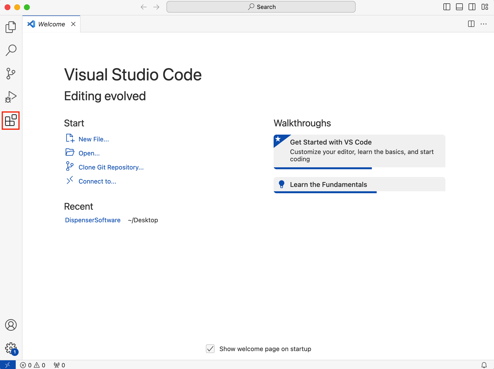
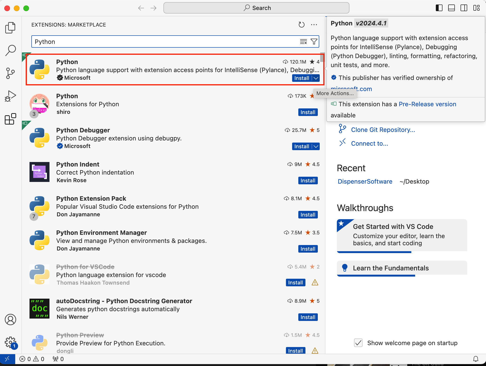
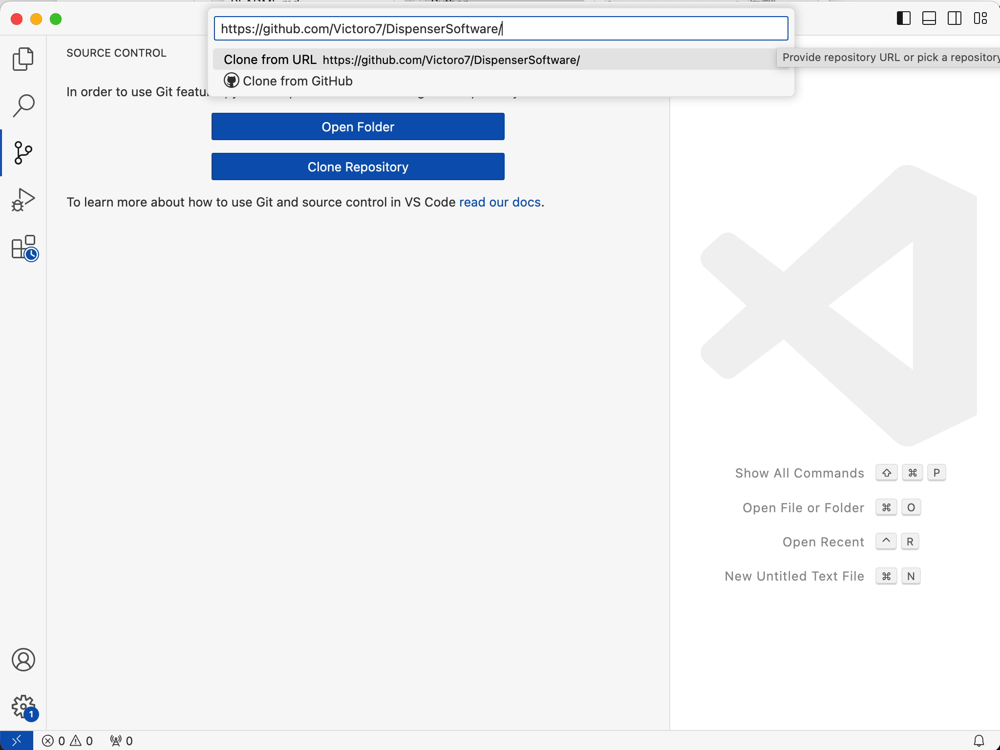
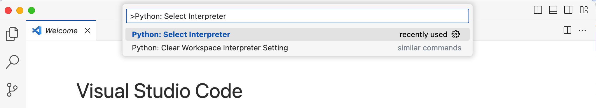
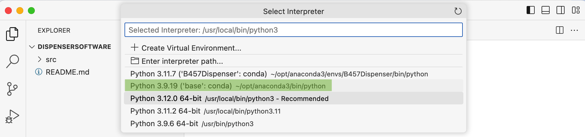
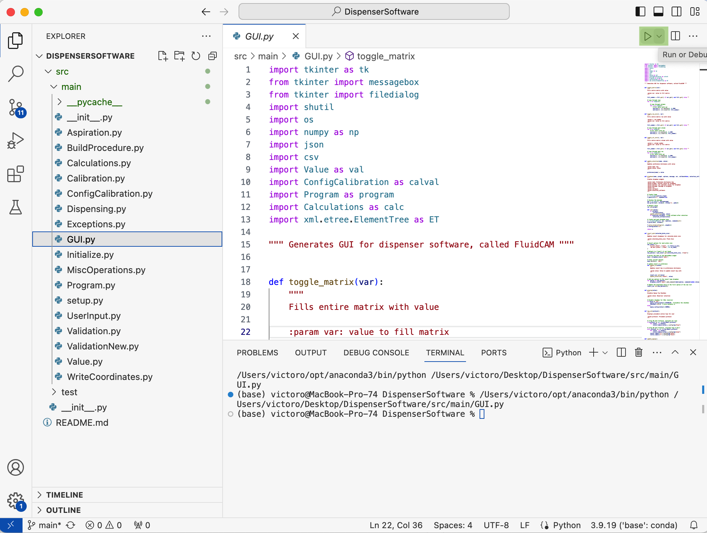
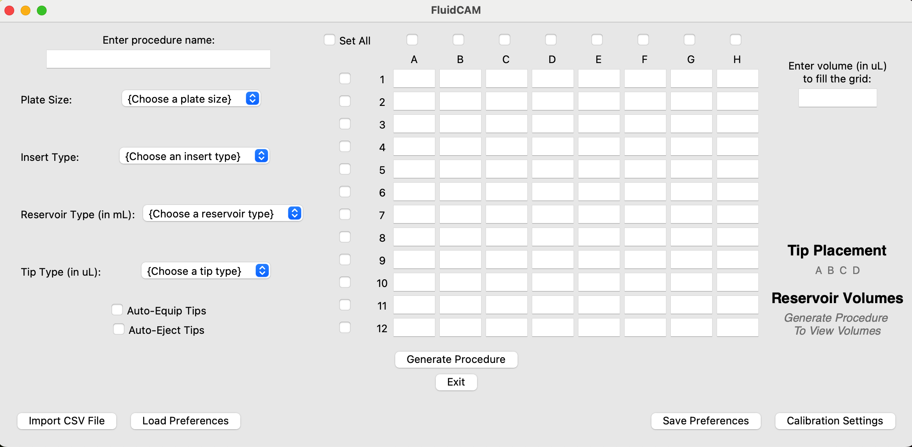

# Apricell Cell and Hydrogel Dispensing Software

The following Github Repository Holds the Fluid Cam Software Created for the Apricell Fluid Dispenser. 

It is required to be used to select which wells will be filled, and with how much material(range of 20ul - 200ul).

The user manual covers how wells are extruded into in pairs, requiring the user to select both wells to extrude.

After the .gcode file is generated by the Fluid Cam Software, you may exit the software(or keep open if it is required to be used again), upload the file to RepetierHost when USB connected to the 3D Printer and begin the print.  

## First Time User Summary of Github 
1. READ THE ENTIRETY OF THE INSTRUCTIONS
2. Pre-Installation and Settings up Visual Studio is required to be completed ONCE.
3. Opening Fluid Cam Part 1 may be needed if the folder is not opened correctly.
4. Opening Fluid Cam Part 2 and Using Fluid Cam is required each time. 
 
## Pre-Installing Softwares For Windows and MAC Users
Running FluidCAM is the same for both MAC and Windows users.

First, download Microsoft Visual Studio Code to your computer [Here](https://code.visualstudio.com/download)

Then, download the Python Anaconda Distribution to your computer [Here](https://www.anaconda.com/download) 

## Setting up Visual Studio
Open Visual Studio, then open the "Extensions" menu in the left sidebar (last icon from the top)

Search for the "Python" extension, and click install.

Next, open the "Source Control" menu in the left side bar (middle icon).
Select "Clone Repository", then paste this URL into the entry box: https://github.com/Victoro7/DispenserSoftware

## Opening FluidCAM software

Switch the interpreter to anaconda. Open the Command Palette (Ctrl+Shift+P) and type the command **Python: Select Interpreter**

Select Python bundled by Anaconda

Open up GUI.py in the explorer menu (first icon in left sidebar) [DispenserSoftware > src > main > GUI.py] 

Click on the **RUN** icon in the top left to start the FluidCAM software.

The FluidCAM window should open. You can now use the program.

## Using FluidCAM
After installation, to use FluidCAM:

Open VS Code on your computer, open the project **DispenserSoftware**, navigate to **GUI.py** and run the program.

