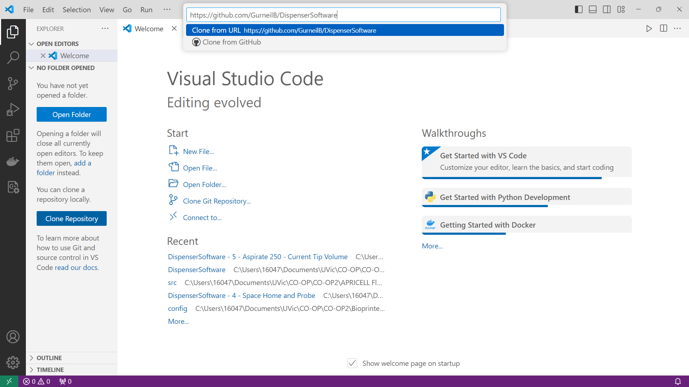
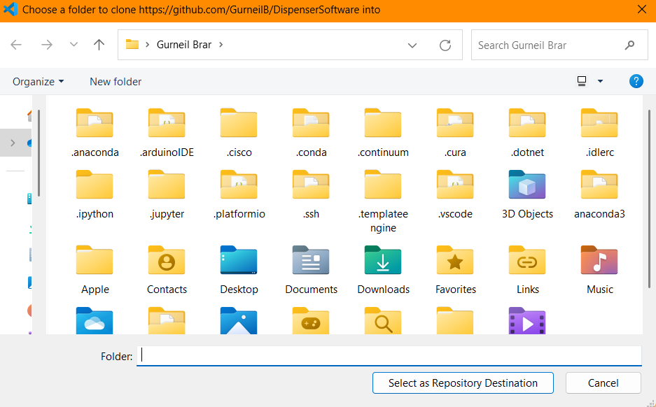
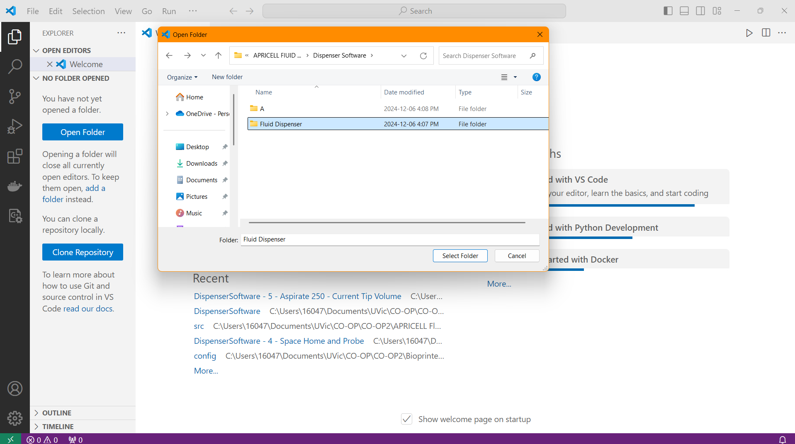
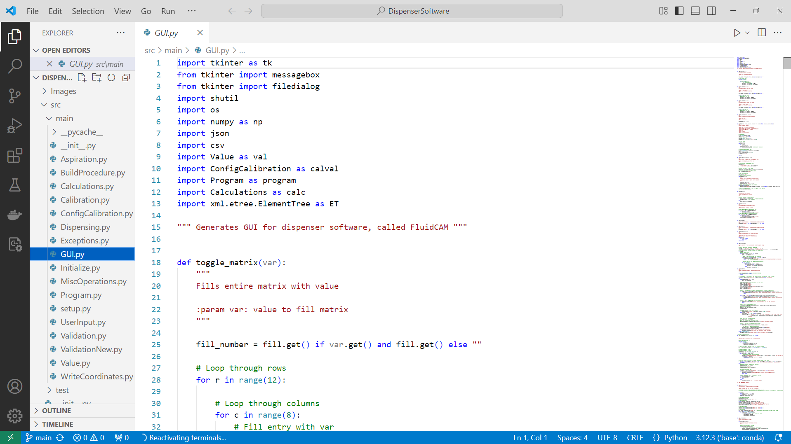
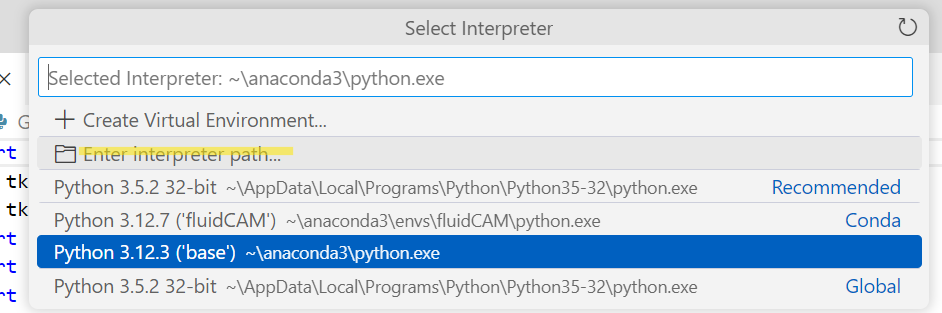
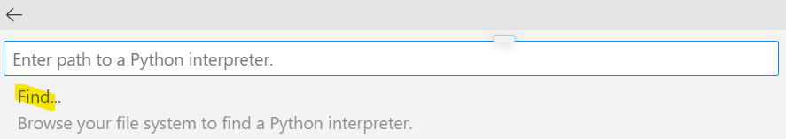
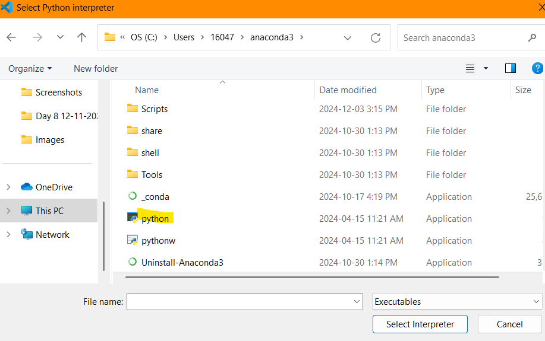
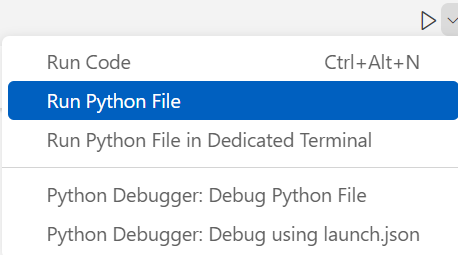

# Apricell Cell and Hydrogel Dispensing Software

## User Summary of this Github Repository 
The following Github Repository holds the FluidCAM software created for the Apricell Fluid Dispenser. 

Important things to note: 
1. READ THE ENTIRETY OF THE INSTRUCTIONS BEFORE THE FIRST USE
2. Pre-Installation and Setting up Visual Studio is required to be completed **ONCE**
3. Opening FluidCAM and Using FluidCAM is required **EACH TIME**
4. The software requires users to select which wells will be filled, and how much material(range between 20ul - 200ul or 0)
5. After the .gcode file is generated by the FluidCAM Software, you may exit the software(or keep open if it is required to be used again), upload the file to RepetierHost via usb connection, and begin the print.  

 
## Pre-Installing Softwares For Windows and MAC Users
Running FluidCAM is the same for both MAC and Windows users.

First, download Microsoft Visual Studio Code to your computer. [Here](https://code.visualstudio.com/download)

Then, download the Python Anaconda Distribution to your computer. [Here](https://www.anaconda.com/download) 

## Setting up Visual Studio
Open Visual Studio, then open the "Extensions" menu in the left sidebar (last icon from the top).

Search for the "Python" extension, and click install.

## Opening FluidCAM software
Open the "Source Control" menu in the left side bar (middle icon).

### First Time Setup
Select "Clone Repository", then paste this URL into the entry box: 
>https://github.com/GurneilB/DispenserSoftware 

Note: If this is your first time cloning a repository, you may have to download GIT onto your computer.

The user will then be prompted to save the file onto their computer. Save the folder in a location that will be **EASILY ACCESSIBLE** for future logins

### Subsequent Setups
Select "Open Folder" and locate the Dispenser Software Folder in you files. 

Open up GUI.py in the explorer menu (first icon in left sidebar) [DispenserSoftware > src > main > GUI.py] 

To switch the interpreter to Anaconda, open the Command Palette (Ctrl+Shift+P) and type the command: **>Python: Select Interpreter**

Select Enter Interpreter Path...

Select Find...

Select the Python executable located in the Anaconda3 folder

Click on the **RUN** icon in the top left to start the FluidCAM software. If not opening, read troubleshoot below image.

_________________________________________________________________________________________________________________________________
### Troubleshooting Question: Run Not Working 
If clicking the **RUN** icon is not working, select the arrow beside the **RUN** icon. This will open a dropdown menu from which you can select "Run Python File".

_________________________________________________________________________________________________________________________________
The FluidCAM window should open. The user manual indicates how to modify and save your file, as well as how to upload it to the Fluid Dispenser.

## Using FluidCAM
After installation, to use FluidCAM:

Open VS Code on your computer, open the project **DispenserSoftware**, navigate to **GUI.py** and run the program(you may need to select interpreter again).

